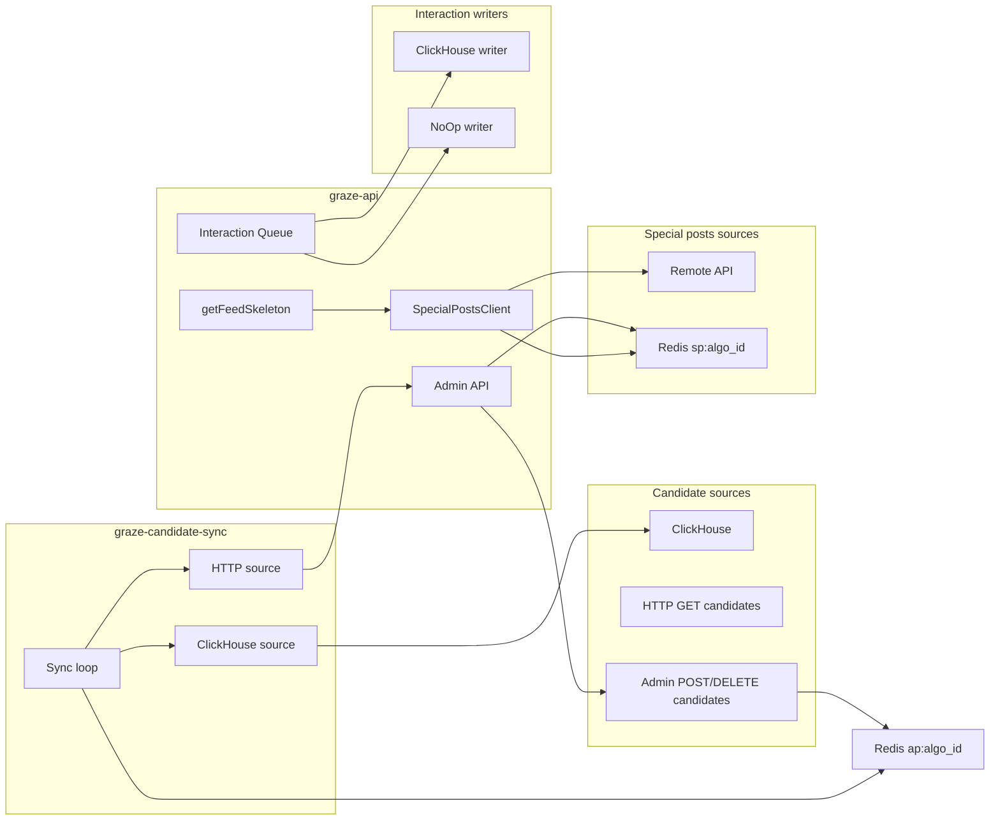

# Architecture

This document describes the data flow for candidates, special posts, and interactions, and how the single ClickHouse module fits in with pluggable backends.

## High-level diagram

Admin and the worker both read/write the Redis candidate set (`ap:{algo_id}`). The worker can pull candidates from ClickHouse (query `algorithm_posts_v2`) or from the API’s GET candidates endpoint.

## ClickHouse module

**Location**: `crates/graze-common/src/clickhouse/`

A single module handles all ClickHouse usage:

- **Config** (`config.rs`): Shared connection settings (host, port, database, auth, secure). Used by both writer and reader.
- **Writer** (`writer.rs`): HTTP INSERT into `feed_interactions_buffer` and `user_action_logs_buffer`. Used when `INTERACTIONS_WRITER=clickhouse`.
- **Reader** (`reader.rs`): HTTP SELECT from `algorithm_posts_v2` for candidate URIs. Used when `CANDIDATE_SOURCE=clickhouse` in the candidate-sync worker.

Pluggable backends are defined via traits in `traits.rs` so you can run without ClickHouse or with alternative implementations.

## Interaction writes

- **Trait**: `InteractionWriter::persist_batch(feed_rows, action_rows)` in `graze-common/clickhouse/traits.rs`.
- **Implementations**:
  - `ClickHouseInteractionWriter`: uses the ClickHouse writer to INSERT. Use when `INTERACTIONS_WRITER=clickhouse`.
  - `NoOpInteractionWriter`: no-ops. Use when `INTERACTIONS_WRITER=none` (e.g. no analytics).
- **Flow**: `InteractionsClient` (in `graze-common/services/interactions.rs`) prepares rows and calls the configured writer. The API only holds `InteractionsClient`; it does not talk to ClickHouse directly.

## Candidate reads (sync worker)

- **Trait**: `CandidateSource::fetch_candidates(algo_id) -> Vec<String>` (URIs) in `graze-common/clickhouse/traits.rs`.
- **Implementations**:
  - `ClickHouseCandidateSource`: queries `algorithm_posts_v2` via the ClickHouse reader (two-pass time window). Use when `CANDIDATE_SOURCE=clickhouse`.
  - `HttpCandidateSource`: GET `{CANDIDATE_HTTP_URL}/v1/feeds/{algo_id}/candidates`, expects `{ "uris": [...] }`. Use when `CANDIDATE_SOURCE=http`.
  - `AdminOnlyCandidateSource`: returns an empty list. Use when `CANDIDATE_SOURCE=admin_only`; only admin HTTP (and optional manual sync triggers) populate candidates.
- **Flow**: The candidate-sync worker holds `Arc<dyn CandidateSource>`. Each sync calls `source.fetch_candidates(algo_id)`, then interns URIs and runs the existing `store_posts` pipeline (atomic swap into `ap:{algo_id}`). Fallback tranches and algo likers sync are unchanged.

## Special posts

- **Sources**:
  - **Remote** (`SPECIAL_POSTS_SOURCE=remote`): `SpecialPostsClient` fetches from an external API (e.g. `api.graze.social`), caches in Redis `sp:{algo_id}` with 60s TTL.
  - **Local** (`SPECIAL_POSTS_SOURCE=local`): No external call; read/write Redis `sp:{algo_id}` only. Admin CRUD (pinned, rotating, sponsored) is the source of truth. Cache uses a long TTL.
- **Flow**: Feed skeleton and admin both use the same Redis key. Local mode is intended for open-source or air-gapped setups where no external special-posts API exists.

## Configuration summary

| Area            | Config key(s)                    | Backends / behavior |
|----------------|-----------------------------------|----------------------|
| Interactions   | `INTERACTIONS_WRITER`            | `clickhouse` \| `none` |
| Candidates     | `CANDIDATE_SOURCE`, `CANDIDATE_HTTP_URL` | `clickhouse` \| `http` \| `admin_only` |
| Special posts  | `SPECIAL_POSTS_SOURCE`, `SPECIAL_POSTS_API_BASE` | `remote` \| `local` |

See [CONFIGURATION.md](CONFIGURATION.md) for all environment variables and [ADMIN_API.md](ADMIN_API.md) for admin endpoints.
